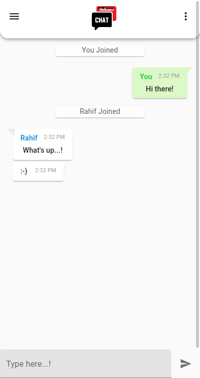
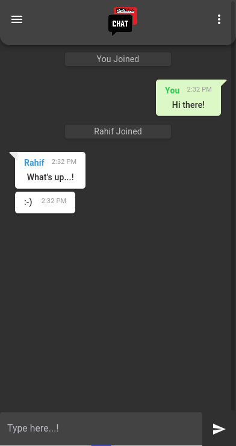
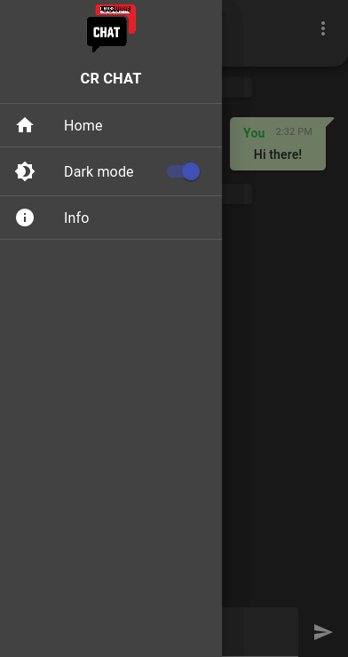
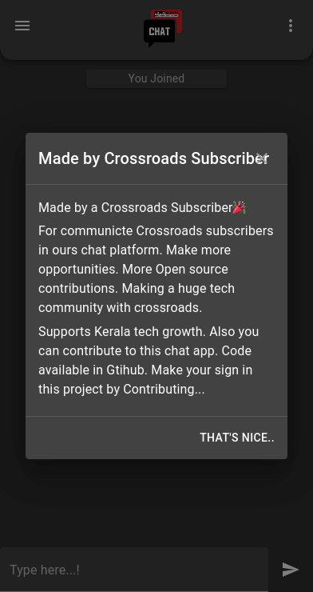
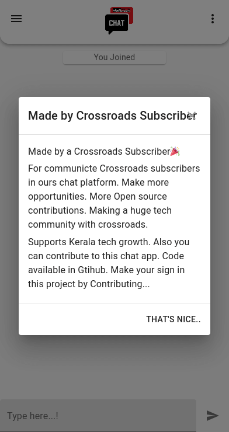
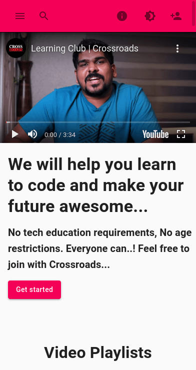
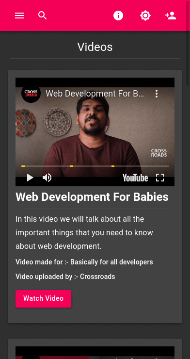
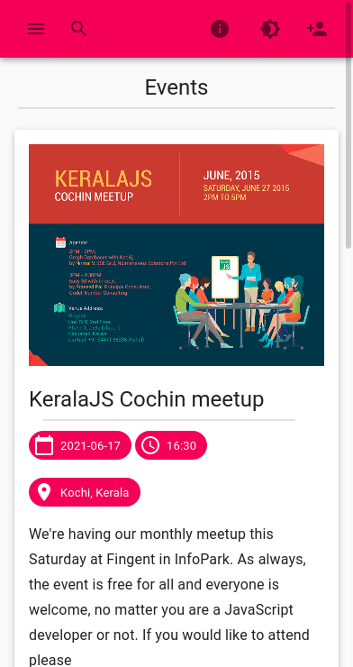

<!-- PROJECT LOGO -->
 

  

  <h3 align="center">Crossroads Subscribers Hub</h3>

  

    This is a Progressive Web App made for crossroads subscribers 🎉️ !
     
    <a href="https://crossroads-chat.herokuapp.com/"><strong>View Live Deploy ( Chat App ) »</strong></a>
     
     
    <a href="https://github.com/Muhammed-Rahif/Crossroads-Subscribers-Hub">Project Directory</a>
    ·
    <a href="https://github.com/Muhammed-Rahif/Crossroads-Subscribers-Hub/issues">Report Bug</a>
    ·
    <a href="https://github.com/Muhammed-Rahif/Crossroads-Subscribers-Hub/pulls">Contribute</a>
  

## 🧐 About 

Write about 1-2 paragraphs describing the purpose of your project.

## 🧐 Screenshots 

### Chat app ( Branch `react` )

  
  
  
  
  

### Subscribers Hub ( Branch `version2` )

  
  
  
  

## ⛏️ Built Using 

- [MongoDB](https://www.mongodb.com) - Cross-platform document-oriented database
- [Express](https://expressjs.com/) - Minimalist web framework for Node.js
- [ReactJs](https://reactjs.org/) - A JavaScript library for building user interfaces
- [NodeJs](https://nodejs.org/en/) - Back-end JavaScript runtime environment
- [Material-UI](https://material-ui.com/) - A popular React UI framework
- [Socket.IO](https://socket.io/) - A JavaScript library for realtime web applications

## ✍️ Authors 

- [@Muhammed-Rahif](https://github.com/Muhammed-Rahif) - Idea & Full work

<!-- See also the list of [contributors](https://github.com/kylelobo/The-Documentation-Compendium/contributors) who participated in this project. -->

<!-- ## 🎉 Acknowledgements 

- Hat tip to anyone whose code was used
- Inspiration
- References -->
